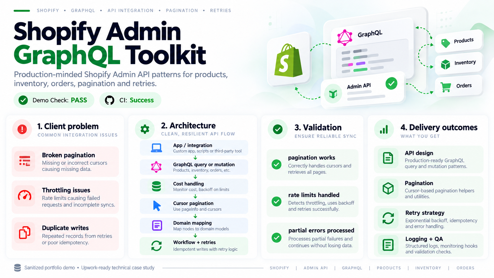
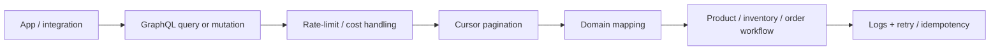

# Shopify Admin GraphQL Toolkit

> **Production-minded Shopify Admin API patterns for products, inventory, orders, pagination and retries.**

[](https://github.com/beltebaiken-star/shopify-admin-graphql-toolkit)
[](https://github.com/beltebaiken-star/shopify-admin-graphql-toolkit/actions/workflows/demo-check.yml)
[](https://www.upwork.com/freelancers/baikenbelte)

## Client problem

Shopify integrations often break in production because pagination, throttling, partial GraphQL errors and duplicate writes are treated as afterthoughts.

## What this project proves

This project demonstrates cursor pagination, explicit API boundaries and retry/idempotency thinking using a safe synthetic pagination demo.

## Visual proof

The visual below summarizes the **client problem, architecture, validation logic, and delivery outcomes** for this sanitized technical case study.



## Architecture



## Quick start

```bash
git clone https://github.com/beltebaiken-star/shopify-admin-graphql-toolkit.git
cd shopify-admin-graphql-toolkit
npm test
```

**What the demo checks:** Runs a synthetic two-page product pagination flow and verifies that all products are collected without an external Shopify store.

No Shopify credentials are required for the demo.

## What I would deliver on a client project

- Admin API / GraphQL integration design
- Product/inventory/order workflow implementation
- Cursor pagination
- Rate-limit aware retry strategy
- Error handling and idempotency
- API version review
- Production logging/QA checklist

## Production QA principles

- Validate authentication and authorization boundaries.
- Design for retries without duplicate side effects.
- Keep external API behavior isolated from domain logic.
- Log enough context to diagnose failures without exposing secrets.
- Test failure cases and recovery paths, not only the happy path.
- Document rollout and rollback expectations.

## Repository map

```text
demo/                 runnable synthetic validation
examples/             safe implementation examples
docs/architecture.md  technical architecture notes
docs/qa-checklist.md  production verification checklist
README.md              client-facing case study
```

## Security & portfolio note

This repository is a **sanitized technical portfolio demo**. It contains no production credentials, customer data, private URLs, access tokens or proprietary client source code.

## Hire / contact

I take on focused Shopify development, API integration, automation and production troubleshooting projects.

**Upwork:** https://www.upwork.com/freelancers/baikenbelte
